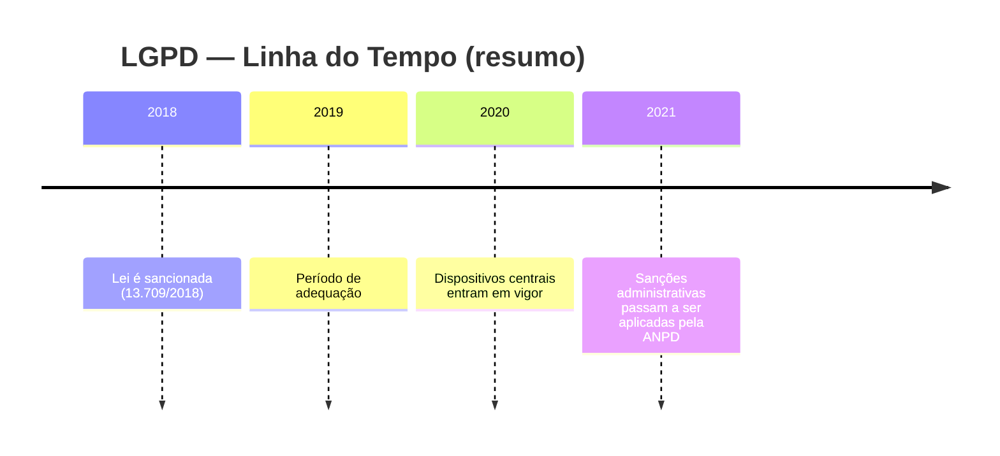

# ⚖️ LGPD — Lei Geral de Proteção de Dados Pessoais

> **Objetivo da aula:** entender o que é a LGPD, por que ela existe, sua relação com o GDPR e quando passou a valer no Brasil, com exemplos práticos do cotidiano escolar e digital.

---

## 🧭 Sumário

- [⚖️ LGPD — Lei Geral de Proteção de Dados Pessoais (Visão Introdutória)](#️-lgpd--lei-geral-de-proteção-de-dados-pessoais-visão-introdutória)
  - [🧭 Sumário Rápido](#-sumário-rápido)
  - [1. Definição e propósito da LGPD](#1-definição-e-propósito-da-lgpd)
  - [2. “Tratamento” de dados: o que a lei regula?](#2-tratamento-de-dados-o-que-a-lei-regula)
  - [3. Conceitos-chave (mini glossário)](#3-conceitos-chave-mini-glossário)
  - [4. LGPD × GDPR (união e diferenças)](#4-lgpd--gdpr-união-e-diferenças)
  - [5. Linha do tempo: da sanção à vigência](#5-linha-do-tempo-da-sanção-à-vigência)
  - [6. Exemplos explicados (contexto de aluno, escola e apps)](#6-exemplos-explicados-contexto-de-aluno-escola-e-apps)
    - [🎒 Exemplo A — Lista de chamada com nome completo e foto](#-exemplo-a--lista-de-chamada-com-nome-completo-e-foto)
    - [🧾 Exemplo B — Emissão de boleto escolar](#-exemplo-b--emissão-de-boleto-escolar)
    - [📱 Exemplo C — Inscrição num aplicativo de estudo](#-exemplo-c--inscrição-num-aplicativo-de-estudo)
    - [🏥 Exemplo D — Atestado médico (dado sensível)](#-exemplo-d--atestado-médico-dado-sensível)
    - [🛒 Exemplo E — Loja virtual que sofreu vazamento](#-exemplo-e--loja-virtual-que-sofreu-vazamento)
  - [7. Mitos e Verdades](#7-mitos-e-verdades)
  - [8. Checklist rápido “Isso é LGPD?”](#8-checklist-rápido-isso-é-lgpd)
  - [9. Exercícios de Fixação (modelo UC18)](#9-exercícios-de-fixação-modelo-uc18)
    - [9.1 Dissertativas](#91-dissertativas)
    - [9.2 Múltipla escolha (uma correta)](#92-múltipla-escolha-uma-correta)
    - [9.3 Associação (ligue os termos às definições)](#93-associação-ligue-os-termos-às-definições)
    - [9.4 Verdadeiro ou Falso (marque a sequência correta)](#94-verdadeiro-ou-falso-marque-a-sequência-correta)
    - [9.5 Estudo de Caso (resposta aberta)](#95-estudo-de-caso-resposta-aberta)
  - [10. Atividade Prática Guiada](#10-atividade-prática-guiada)
    - [💬 Fechamento (mensagem do(a) professor(a))](#-fechamento-mensagem-doa-professora)

---

## 1. Definição e propósito da LGPD

> **A LGPD é a lei brasileira que regula o tratamento de dados pessoais em meios físicos e digitais.**
> Seu propósito é **proteger direitos fundamentais**, especialmente **privacidade**, **liberdade** e o **livre desenvolvimento da personalidade**.

**Em outras palavras:**
A LGPD estabelece **regras** para como dados que **identificam** alguém podem ser **coletados, usados, compartilhados, armazenados e excluídos**. Ela vale para **empresas, escolas, órgãos públicos e pessoas** que tratam dados **com finalidade econômica** ou **organizacional**.

> 💡 **Por que isso importa?**
> Porque nossos dados contam a nossa história (hábitos, saúde, localização, preferências). Usos indevidos podem gerar discriminação, golpes, vazamentos e prejuízos.

---

## 2. “Tratamento” de dados: o que a lei regula?

**Tratamento** é todo ato realizado com dados pessoais, por exemplo:

- **Coletar** (formulários, cadastros, inscrições on-line);
- **Produzir/classificar** (organizar listas por turma, idade, notas);
- **Armazenar/arquivar** (HD, nuvem, planilhas);
- **Acessar/utilizar** (consultar dados para emitir boletos ou históricos);
- **Compartilhar/transferir** (enviar para terceiros, publicar em site);
- **Eliminar** (excluir definitivamente, com segurança).

> 🧩 **Ciclo de vida dos dados (visão simples):** > **Coleta → Uso → Compartilhamento → Armazenamento → Arquivamento → Eliminação**
> A LGPD exige **transparência**, **segurança** e **base legal** em cada etapa.

---

## 3. Conceitos-chave (mini glossário)

- **Dado pessoal:** informação que **identifica** uma pessoa (nome, CPF, e-mail, foto, matrícula).
- **Dado pessoal sensível:** revela **raça/origem**, **convicção religiosa**, **opinião política**, **saúde**, **vida sexual**, **dado biométrico**.

  > ⚠️ Exige **cuidado reforçado**.

- **Dado anonimizado:** dado **sem identificação** do titular, **irreversível** (em regra, fica fora da LGPD).
- **Titular:** a pessoa **dona do dado** (você, seus responsáveis, colegas).
- **Controlador:** quem **decide** sobre o tratamento (ex.: a escola).
- **Operador:** quem **executa** o tratamento em nome do controlador (ex.: empresa terceirizada de boletos).
- **Encarregado (DPO):** contato do controlador com os titulares/ANPD.
- **ANPD:** Autoridade Nacional que **fiscaliza** e **orienta** a aplicação da LGPD.

> 📝 **Importante:** A LGPD **não se aplica** ao uso **pessoal e não econômico** (ex.: sua agenda privada), nem a atividades **jornalísticas/artísticas/ acadêmicas** em certas condições, ou **segurança pública/defesa** (regras próprias).

---

## 4. LGPD × GDPR (união e diferenças)

A LGPD **se inspira** no **GDPR** (regulamento europeu) — ambos protegem dados e reforçam direitos.
Resumo comparativo para situar:

| Aspecto            | LGPD (Brasil)                                                                   | GDPR (União Europeia)                              |
| ------------------ | ------------------------------------------------------------------------------- | -------------------------------------------------- |
| Natureza           | Lei nacional (Lei nº 13.709/2018)                                               | Regulamento europeu (direito supranacional)        |
| Órgão fiscalizador | **ANPD**                                                                        | Autoridades de cada país (DPAs)                    |
| Escopo             | Tratamento de dados no BR; efeitos extraterritoriais em certos casos            | Tratamento na UE; efeitos extraterritoriais amplos |
| Bases legais       | Conjunto similar (ex.: consentimento, obrigação legal, legítimo interesse etc.) | Conjunto consolidado no GDPR                       |
| Encarregado (DPO)  | **Encarregado** (papel análogo)                                                 | **Data Protection Officer (DPO)**                  |
| Multas             | Percentual do faturamento e teto por infração                                   | Percentuais sobre faturamento global               |

> 🎯 **Essência comum:** **Transparência**, **finalidade**, **minimização**, **segurança** e **direitos do titular**.

---

## 5. Linha do tempo: da sanção à vigência

> ✅ **Para memorizar:** **“Entrou em vigor em 2020.”**
> A partir de 2021, a ANPD passou a **aplicar sanções** administrativas (advertência, multa, bloqueio/exclusão de dados etc.).

---

## 6. Exemplos explicados (contexto de aluno, escola e apps)

### 🎒 Exemplo A — Lista de chamada com nome completo e foto

- **O que é?** Dado pessoal (identifica diretamente).
- **Tratamento:** coleta, armazenamento, consulta diária.
- **Cuidados LGPD:** informar finalidade (chamada), restringir acesso (professores/secretaria), guardar com segurança, excluir quando não mais necessário.

### 🧾 Exemplo B — Emissão de boleto escolar

- **Dados:** nome do aluno/responsável, CPF, endereço, contato.
- **Base típica:** **cumprimento de obrigação legal/contratual** (não confundir tudo com “consentimento”).
- **Prática:** somente o necessário (minimização), sistema com senha, sem envio a terceiros sem justificativa.

### 📱 Exemplo C — Inscrição num aplicativo de estudo

- **Dados:** e-mail/matrícula, turma, preferências de estudo.
- **Transparência:** termos claros (para quê? por quanto tempo? com quem compartilha?).
- **Direito do titular:** solicitar **acesso** aos dados, **correção** e **exclusão** quando aplicável.

### 🏥 Exemplo D — Atestado médico (dado sensível)

- **Sensível:** **saúde** → proteção reforçada.
- **Prática:** acesso **estritamente necessário** (secretaria/coordenação), **sigilo**, armazenamento seguro, **não divulgar** em listas públicas.

### 🛒 Exemplo E — Loja virtual que sofreu vazamento

- **Incidente:** exposição de e-mails e senhas.
- **Deveres:** comunicar **afetados** e **ANPD**, adotar medidas, revisar segurança, orientar troca de senhas.

---

## 7. Mitos e Verdades

- “**LGPD é só sobre internet**.” → **Mito.** Vale para **papel** e **digital**.
- “**Tudo precisa de consentimento**.” → **Mito.** Existem **outras bases legais** (ex.: obrigação legal/contratual).
- “**Se anonimizo, não é LGPD**.” → **Parcial.** Se a anonimização for **irreversível**, em regra sai do escopo; se **reversível**, **continua** sujeito.
- “**LGPD trava o trabalho da escola**.” → **Mito.** A LGPD **organiza** e **protege** — com planejamento, tudo flui.

---

## 8. Checklist rápido “Isso é LGPD?”

Antes de coletar/usar/compartilhar:

1. **Finalidade:** para quê exatamente?
2. **Necessidade:** é o **mínimo** necessário?
3. **Transparência:** o titular **sabe**? está **claro**?
4. **Base legal:** qual **autoriza** esse tratamento?
5. **Segurança:** como será **protegido**?
6. **Ciclo de vida:** quando e **como excluir**?

> 🧠 Memorize a tríade: **Finalidade — Necessidade — Transparência**.

---

## 9. Exercícios de Fixação (modelo UC18)

> **Instrução:** Responda no caderno (ou use o modelo de questões da UC18). Seja objetivo e didático.

### 9.1 Dissertativas

1. **Explique com suas palavras o que é a LGPD** e por que ela é importante para estudantes e escolas.
2. A LGPD foi **inspirada no GDPR**. Aponte **duas semelhanças** e **duas diferenças** relevantes no contexto brasileiro.

### 9.2 Múltipla escolha (uma correta)

1. A LGPD:

   - [ ] É uma norma interna de redes sociais.
   - [ ] É uma lei europeia aplicada no Brasil.
   - [ ] **Regula o tratamento de dados pessoais no Brasil.**
   - [ ] Trata apenas de dados sensíveis.

2. Sobre vigência:

   - [ ] **Entrou em vigor em 2020.**
   - [ ] Entrou em vigor em 2016.
   - [ ] Entrará em vigor em 2030.
   - [ ] Ainda não está vigente.

3. No contexto da LGPD, “tratamento” **não** inclui:

   - [ ] Coleta e armazenamento.
   - [ ] Compartilhamento e exclusão.
   - [ ] **Nada disso — todas as opções são tratamento.**
   - [ ] Uso e classificação.

### 9.3 Associação (ligue os termos às definições)

| Nº  | Termo         | Definição                                                    |
| --- | ------------- | ------------------------------------------------------------ |
| 1   | LGPD          | ( ) Lei brasileira que regula o tratamento de dados pessoais |
| 2   | GDPR          | ( ) Regulamento europeu de proteção de dados                 |
| 3   | ANPD          | ( ) Autoridade que fiscaliza e orienta a aplicação da LGPD   |
| 4   | Dado sensível | ( ) Informação sobre saúde, religião, biometria etc.         |

### 9.4 Verdadeiro ou Falso (marque a sequência correta)

1. A LGPD protege direitos como privacidade e liberdade.
2. A LGPD foi inspirada no GDPR.
3. “Tratamento” inclui coletar, usar, compartilhar e excluir.
4. A LGPD aplica-se apenas ao ambiente digital.

Opções:

- [ ] V — F — V — V
- [ ] V — V — V — F
- [ ] F — V — F — V
- [ ] V — V — F — F

### 9.5 Estudo de Caso (resposta aberta)

Uma escola pretende publicar no site oficial **boletim com nomes completos e notas** de todos os alunos.

- Identifique **quais dados** estão envolvidos e que tipo são.
- Explique **se é adequado** publicar e **por quê**, à luz da LGPD.
- Proponha **duas alternativas** que garantam transparência sem expor dados pessoais indevidamente.

---

## 10. Atividade Prática Guiada

> **Mapeamento de dados (15–20 min, em dupla)**

1. Escolha um serviço digital educacional (ex.: plataforma de tarefas).
2. Liste **quais dados** ele pede (e-mail, nome, turma, métricas de desempenho etc.).
3. Classifique: **pessoais** × **sensíveis** × **anonimizados** (se houver).
4. Indique a **finalidade** declarada. Está **clara**?
5. Cite uma **medida de segurança** que você esperaria ver (ex.: autenticação, criptografia).
6. Diga **quando** esses dados **deveriam ser excluídos**.

> 🎯 **Entregável:** um quadro resumido (tabela) no caderno ou documento compartilhado.

---

### 💬 Fechamento (mensagem do(a) professor(a))

> “LGPD não é um muro, é um **mapa**: mostra **como** usar dados com **respeito**, **clareza** e **segurança**. Entender o que ela é — e quando começou a valer — é o primeiro passo para **cidadania digital responsável**.”

---
