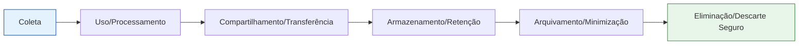

# 📖 Capítulo 2 — Conceitos Fundamentais da LGPD

> **Objetivo do capítulo:** dominar o **vocabulário essencial** da LGPD (o “alfabeto” da privacidade), entender **quem é quem** no tratamento de dados, **quando** a lei se aplica e **quais princípios e bases legais** guiam o uso responsável de dados no cotidiano escolar, social e profissional.

---

## 🧭 Sumário

- [📖 Capítulo 2 — Conceitos Fundamentais da LGPD](#-capítulo-2--conceitos-fundamentais-da-lgpd)
  - [🧭 Sumário](#-sumário)
  - [1. Escopo e Abrangência: quando a LGPD se aplica (e quando não)](#1-escopo-e-abrangência-quando-a-lgpd-se-aplica-e-quando-não)
  - [2. Dados Pessoais: identificação direta e indireta](#2-dados-pessoais-identificação-direta-e-indireta)
  - [3. Dados Pessoais Sensíveis: por que exigem cuidado redobrado](#3-dados-pessoais-sensíveis-por-que-exigem-cuidado-redobrado)
  - [4. Pseudonimização × Anonimização](#4-pseudonimização--anonimização)
  - [5. Titular, Crianças e Adolescentes (melhor interesse)](#5-titular-crianças-e-adolescentes-melhor-interesse)
  - [6. Agentes de Tratamento: Controlador, Operador e Encarregado (DPO)](#6-agentes-de-tratamento-controlador-operador-e-encarregado-dpo)
  - [7. Ciclo de Vida do Dado (mapa visual)](#7-ciclo-de-vida-do-dado-mapa-visual)
  - [8. Bases Legais (as 10 hipóteses)](#8-bases-legais-as-10-hipóteses)
  - [9. Princípios da LGPD (o “código de honra”)](#9-princípios-da-lgpd-o-código-de-honra)
  - [10. Quadros-Resumo de Apoio Rápido](#10-quadros-resumo-de-apoio-rápido)
    - [10.1 É **dado pessoal**?](#101-é-dado-pessoal)
    - [10.2 **Sensível** ou **comum**?](#102-sensível-ou-comum)
    - [10.3 **Quem é quem** (agentes)](#103-quem-é-quem-agentes)
  - [11. Exemplos Explicados (escola, apps, trabalho)](#11-exemplos-explicados-escola-apps-trabalho)
    - [🏫 Caso 1 — Publicar fotos do evento escolar no Instagram da escola](#-caso-1--publicar-fotos-do-evento-escolar-no-instagram-da-escola)
    - [🧾 Caso 2 — Emissão de boletos e relatórios financeiros](#-caso-2--emissão-de-boletos-e-relatórios-financeiros)
    - [🩺 Caso 3 — Emergência médica em aula de educação física](#-caso-3--emergência-médica-em-aula-de-educação-física)
    - [📱 Caso 4 — App de estudos que usa geolocalização](#-caso-4--app-de-estudos-que-usa-geolocalização)
  - [12. Exercícios de Fixação (modelo UC18)](#12-exercícios-de-fixação-modelo-uc18)
    - [12.1 Dissertativas](#121-dissertativas)
    - [12.2 Múltipla Escolha (uma correta)](#122-múltipla-escolha-uma-correta)
    - [12.3 Associação (ligue as colunas)](#123-associação-ligue-as-colunas)
    - [12.4 Verdadeiro ou Falso (sequência)](#124-verdadeiro-ou-falso-sequência)
    - [12.5 Estudo de Caso](#125-estudo-de-caso)
  - [13. Atividade Prática Guiada + Rubrica](#13-atividade-prática-guiada--rubrica)
    - [🔧 Mapeamento de Dados da Escola (em trio, 25–30 min)](#-mapeamento-de-dados-da-escola-em-trio-2530-min)
  - [14. Fechamento](#14-fechamento)

---

## 1. Escopo e Abrangência: quando a LGPD se aplica (e quando não)

**Aplica-se** ao tratamento de **dados pessoais** realizado:

- No **Brasil** (por pessoa, empresa, escola, órgão público);
- Ou com **oferta de bens/serviços** a pessoas no Brasil;
- Ou quando os dados **coletados no Brasil** são tratados em outro país.

**Exceções comuns (fora do escopo):**

- Uso **exclusivamente pessoal e não econômico** (ex.: sua agenda privada);
- Finalidades **jornalísticas, artísticas** e **acadêmicas** (com regras próprias);
- **Segurança pública, defesa nacional** e investigações de crimes (regimes específicos).

> 💡 **Dica pedagógica:** sempre pergunte: “**há uma finalidade organizacional ou econômica?**” e “**o dado identifica alguém?**”. Se sim, é forte candidato a **cair na LGPD**.

---

## 2. Dados Pessoais: identificação direta e indireta

**Definição:** qualquer informação relacionada a uma **pessoa natural identificada ou identificável**.

**Identificação direta:** nome completo, CPF, RG, foto do rosto.
**Identificação indireta:** combinação de dados que “apontam” alguém (matrícula + turma + cidade; IP + hora + login; geolocalização habitual).

**Exemplos usuais (escola e apps):**

- Nome, matrícula, e-mail escolar, telefone do responsável;
- Histórico escolar, boletim, frequência;
- Endereço, IP, cookies associados a um perfil;
- Metadados de acesso (horário, dispositivo, navegador).

> ⚠️ **Armadilha comum:** “Só coloquei a matrícula; ninguém sabe quem é.” → **ERRADO.** Matrícula **identifica** o aluno dentro da escola.

---

## 3. Dados Pessoais Sensíveis: por que exigem cuidado redobrado

**Definição (exemplos):** origem racial/étnica, convicção religiosa, opinião política, filiação a sindicato, **dados de saúde**, genéticos, **biométricos**, vida sexual/orientação sexual.

**Por que são críticos?**
Podem gerar **discriminação**, estigma e **exposição** indevida. A LGPD exige **bases legais específicas** e **medidas de segurança reforçadas**.

**Exemplos escolares:**

- Laudos e atestados médicos;
- Biometria para catraca;
- Preferências religiosas em formulários (evite coletar se não for necessário).

---

## 4. Pseudonimização × Anonimização

- **Pseudonimização:** substitui o identificador por um código (“Aluno_97”).
  👉 **Ainda é dado pessoal** (alguém guarda a “chave” de reidentificação).
- **Anonimização:** remove a possibilidade de identificar alguém **de forma irreversível**.
  👉 Em regra, **fora** da LGPD (mas cuidado com **reidentificação** por cruzamentos).

**Exemplo prático:** divulgar “**Taxa de aprovação da 3ºC = 92%**” (sem nomes) é **anonimizado**. Já “**Média de André = 9,8**” **identifica**.

---

## 5. Titular, Crianças e Adolescentes (melhor interesse)

- **Titular:** o **dono** do dado (aluno, responsável, professor, funcionário, cliente).
- **Crianças e adolescentes:** tratamento deve observar o **melhor interesse** do menor; em regra, exige **consentimento específico e em destaque** de pelo menos um **responsável legal** (salvo exceções: proteção da vida, políticas públicas, cumprimento de obrigação legal etc.).
- **Verificação do consentimento:** a escola/app deve adotar **medidas razoáveis** para verificar se o consentimento foi dado pelo responsável.

> 🎯 **Regra de ouro:** **colete o mínimo** de dados de menores, com **transparência** e **linguagem clara**.

---

## 6. Agentes de Tratamento: Controlador, Operador e Encarregado (DPO)

- **Controlador** 🧭
  Define **finalidades** e **meios** do tratamento.
  _Ex.: a escola que decide armazenar boletins e notas no sistema X._

- **Operador** 🛠️
  Trata dados **em nome do controlador**.
  _Ex.: empresa terceirizada que processa os boletos._

- **Encarregado (DPO)** 📮
  Canal entre **titulares**, **controlador** e **ANPD**; orienta equipe, recebe reclamações e pedidos.

**Boas práticas contratuais (Controlador ↔ Operador):**

- Cláusulas de **confidencialidade** e **segurança** (criptografia, controle de acesso);
- Tratamento **somente conforme instruções** do controlador;
- **Notificação de incidentes** (prazos e responsabilidades);
- **Registro** e **auditoria** de operações relevantes.

---

## 7. Ciclo de Vida do Dado (mapa visual)

> 📌 **Checklist por etapa:** > **Coleta:** finalidade clara? dados mínimos?
> **Uso:** base legal? acesso restrito?
> **Compartilhar:** com quem? por quê? contrato?
> **Retenção:** por quanto tempo?
> **Descarte:** como excluir com segurança?

---

## 8. Bases Legais (as 10 hipóteses)

> **Tratar dados exige base legal.** Nem tudo é “consentimento”.
> **Escolha a base pelo objetivo**, não pelo “mais fácil”.

1. **Consentimento** (livre, informado, inequívoco)
2. **Cumprimento de obrigação legal ou regulatória**
3. **Pela Administração Pública** (políticas públicas)
4. **Estudos por órgão de pesquisa** (com garantias)
5. **Execução de contrato** ou procedimentos preliminares
6. **Exercício regular de direitos** (processos)
7. **Proteção da vida** ou **da incolumidade física**
8. **Tutela da saúde** (por profissionais/serviços de saúde)
9. **Interesse legítimo** do controlador/terceiro (com **balanceamento** e respeito a direitos)
10. **Proteção do crédito**

> 💡 **Atalho mental:**
>
> - **Obrigação legal** (tem lei que manda?).
> - **Contrato** (promessa/entrega do serviço?).
> - **Vida/saúde** (emergência?).
> - **Interesse legítimo** (necessário, proporcional, transparente?).
> - **Consentimento** (quando nenhuma outra base se aplica **e** o titular pode escolher).

---

## 9. Princípios da LGPD (o “código de honra”)

1. **Finalidade** — propósito legítimo, específico e explícito.
2. **Adequação** — compatível com a finalidade informada.
3. **Necessidade (minimização)** — apenas o **mínimo** necessário.
4. **Livre acesso** — titulares conseguem **consultar** a forma e duração do tratamento.
5. **Qualidade dos dados** — dados **exatos**, **claros**, **atualizados**.
6. **Transparência** — informações claras, acessíveis, linguagem simples.
7. **Segurança** — medidas técnicas e administrativas para proteção.
8. **Prevenção** — evitar danos **antes** que ocorram.
9. **Não discriminação** — sem fins **discriminatórios** ou abusivos.
10. **Responsabilização e prestação de contas** — demonstrar **conformidade** (provas, registros, relatórios).

> 🧠 **Memorize:** **Fi-Ad-Nec-Li-Qua-Trans-Seg-Prev-NãoDis-Conta**.

---

## 10. Quadros-Resumo de Apoio Rápido

### 10.1 É **dado pessoal**?

| Exemplo                     | É dado pessoal? | Observação                                          |
| --------------------------- | --------------- | --------------------------------------------------- |
| Nome completo “Ana Beatriz” | ✅              | Identificação direta                                |
| Matrícula 3ºC-2025-017      | ✅              | Identificação indireta                              |
| IP + login + horário        | ✅              | Identificação por combinação                        |
| “Turma 3ºC média 8,1”       | ❌\*            | Se **não** for possível reidentificar (anonimizado) |

### 10.2 **Sensível** ou **comum**?

| Dado                 | Tipo     | Por quê                        |
| -------------------- | -------- | ------------------------------ |
| Atestado médico      | Sensível | Saúde                          |
| Biometria na catraca | Sensível | Biometria                      |
| Endereço residencial | Comum    | Identifica, mas não é sensível |

### 10.3 **Quem é quem** (agentes)

| Papel             | O que faz                      | Exemplo                              |
| ----------------- | ------------------------------ | ------------------------------------ |
| Controlador       | Decide finalidade e meios      | Escola                               |
| Operador          | Trata por conta do controlador | Empresa de boletos                   |
| Encarregado (DPO) | Canal com titulares/ANPD       | Responsável de privacidade da escola |

---

## 11. Exemplos Explicados (escola, apps, trabalho)

### 🏫 Caso 1 — Publicar fotos do evento escolar no Instagram da escola

- **Dado:** imagem do rosto (pessoal).
- **Base sugerida:** **consentimento** específico (ou outra adequada conforme contexto).
- **Princípios:** finalidade clara (“divulgação institucional”), minimização (evitar excesso), transparência.
- **Boas práticas:** termo de imagem; opção de **opt-out**; remoção sob solicitação.

### 🧾 Caso 2 — Emissão de boletos e relatórios financeiros

- **Dado:** nome, CPF, e-mail do responsável.
- **Base:** **execução de contrato** e/ou **obrigação legal**.
- **Segurança:** acesso restrito, criptografia em repouso e em trânsito, logs de acesso.

### 🩺 Caso 3 — Emergência médica em aula de educação física

- **Dado:** alergias, tipo sanguíneo (sensíveis).
- **Base:** **proteção da vida**/**tutela da saúde**.
- **Prática:** compartilhar somente com quem precisa; registrar incidente; revisar políticas.

### 📱 Caso 4 — App de estudos que usa geolocalização

- **Dado:** geolocalização (pessoal), hábitos de estudo.
- **Base possível:** **consentimento**/**interesse legítimo** (avaliar **necessidade** e **proporcionalidade**).
- **Transparência:** explicar por que usa localização; permitir desativar; retenção limitada.

---

## 12. Exercícios de Fixação (modelo UC18)

> **Orientação:** responda no caderno seguindo normas de apresentação adotadas pela turma.
> _(Se desejar, use o arquivo “Modelo de Questões” da UC18 para digital.)_

### 12.1 Dissertativas

1. Diferencie **dado pessoal comum**, **dado pessoal sensível**, **pseudonimizado** e **anonimizado**, com **exemplos** do ambiente escolar.
2. Explique as **responsabilidades** de Controlador, Operador e Encarregado (DPO) e **ilustre** com um fluxo real da escola.
3. Liste e explique **cinco princípios** da LGPD e aponte **uma consequência prática** de ignorar cada um deles.

### 12.2 Múltipla Escolha (uma correta)

1. Identifique a **base legal** mais adequada para **emissão de boletos**:

   - [ ] Consentimento
   - [ ] Interesse legítimo
   - [ ] Execução de contrato
   - [ ] Proteção do crédito

2. Sobre **dados sensíveis**, assinale:

   - [ ] CPF é sensível
   - [ ] Biometria é sensível
   - [ ] Endereço é sensível
   - [ ] Matrícula é sensível

3. **Pseudonimização** significa:

   - [ ] Trocar o identificador por um código, **mantendo** possibilidade de reidentificação
   - [ ] Remover a identificação de modo irreversível
   - [ ] Fazer backup em nuvem
   - [ ] Somente criptografar

### 12.3 Associação (ligue as colunas)

| Nº  | Termo              | Definição                                                   |
| --- | ------------------ | ----------------------------------------------------------- |
| 1   | Controlador        | ( ) Define finalidades e meios do tratamento                |
| 2   | Operador           | ( ) Executa tratamento por conta do controlador             |
| 3   | Encarregado (DPO)  | ( ) Canal com titulares e ANPD                              |
| 4   | Interesse legítimo | ( ) Base legal sujeita a teste de balanceamento             |
| 5   | Não discriminação  | ( ) Princípio que veda tratamento com fins discriminatórios |

### 12.4 Verdadeiro ou Falso (sequência)

1. Dados de saúde são **sensíveis**.
2. **Consentimento** é a **única** base legal aplicável.
3. A **anonimização reversível** continua sujeita à LGPD.
4. O **controlador** define finalidades do tratamento.

Opções:

- [ ] V – V – V – F
- [ ] V – F – V – V
- [ ] F – F – V – V
- [ ] V – F – F – F

### 12.5 Estudo de Caso

A coordenação quer publicar **notas individuais** no site público da escola para “transparência”.

- Quais **princípios** estão em risco?
- Que **base legal** seria usada? É adequada?
- Proponha **duas alternativas** que mantenham transparência sem expor dados pessoais.

---

## 13. Atividade Prática Guiada + Rubrica

### 🔧 Mapeamento de Dados da Escola (em trio, 25–30 min)

1. Escolha **um processo** (matrícula, boletim, chamada, eventos, cobrança).
2. Preencha uma **tabela** com: **dados coletados**, **tipo** (comum/sensível), **finalidade**, **base legal**, **agente responsável**, **tempo de retenção**, **medidas de segurança**, **momento da exclusão**.
3. Produza um **mini-diagrama** do **ciclo de vida** (coleta → uso → compartilhamento → retenção → descarte).

**Rubrica de avaliação (0–10):**

- **Exatidão conceitual** (0–3) — classifica corretamente dados e bases.
- **Completude** (0–3) — cobre etapas do ciclo e agentes.
- **Aplicabilidade** (0–2) — propostas de segurança e descarte fazem sentido.
- **Clareza e organização** (0–2) — tabela legível e diagrama coerente.

---

## 14. Fechamento

> “**Princípios** + **bases legais** + **papéis e responsabilidades** formam o **triângulo da conformidade**.
> Dominar esses conceitos é o passo decisivo para praticar **cidadania digital** e atuar profissionalmente com **ética e segurança**.”

---
