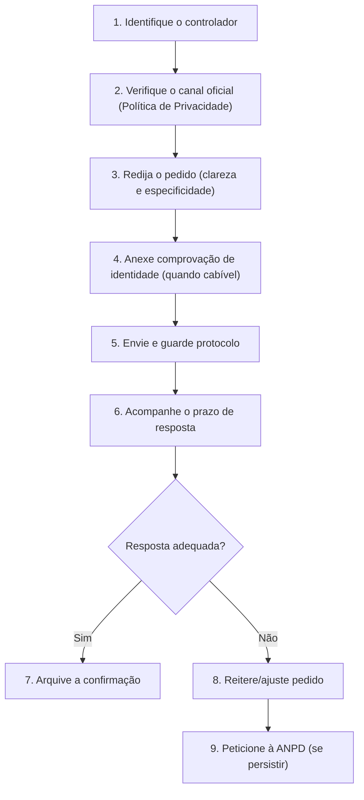

# 🛡️ Capítulo 3 — Direitos dos Titulares de Dados (LGPD)

> **Objetivo do capítulo:** conhecer, compreender e **praticar** os direitos garantidos pela LGPD a toda pessoa (o **titular de dados**), com exemplos e um roteiro de como exercê-los de forma segura e eficaz no cotidiano escolar, social e profissional.

---

## 1) Panorama: quem é o titular e por que seus direitos importam

- **Titular** é a **pessoa natural dona dos dados** (aluno, professor, responsável, cliente, paciente).
- Os direitos existem para **equilibrar a relação** entre quem **coleta/usa** dados (controladores/operadores) e quem **é afetado** por esse uso (titulares).
- A LGPD garante **transparência, controle e correção de rumos** quando o tratamento é inadequado, excessivo ou inseguro.

> 💡 Pense assim: seus dados contam a sua história. Os direitos servem para **ver**, **corrigir**, **levar** e **apagar** partes dessa história quando fizer sentido e quando a lei permitir.

---

## 2) Lista dos direitos (o que pedir e quando)

A LGPD assegura, entre outros, os seguintes **direitos do titular**:

1. **Confirmação da existência de tratamento**  
   ➜ “Vocês tratam **meus** dados?” (sim/não).

2. **Acesso aos dados**  
   ➜ “Quais dados vocês têm sobre mim? Em que formato?”

3. **Correção de dados incompletos, inexatos ou desatualizados**  
   ➜ “Meu endereço mudou. Atualizem, por favor.”

4. **Anonimização, bloqueio ou eliminação** de dados desnecessários, excessivos ou tratados em desconformidade  
   ➜ “Este dado é além do necessário: bloqueiem/removam.”

5. **Portabilidade** a outro fornecedor (observados segredos comercial e industrial e regulamentação)  
   ➜ “Quero levar meus dados para outro serviço.”

6. **Eliminação dos dados tratados com base no consentimento**  
   ➜ “Retirem meus dados coletados **com o meu consentimento**.”

7. **Informação sobre compartilhamento**  
   ➜ “Com quem vocês compartilharam meus dados (públicos/privados)?”

8. **Informação sobre a possibilidade de não consentir e sobre as consequências da negativa**  
   ➜ “Se eu não aceitar, o que acontece? Deixo de usar quais serviços?”

9. **Revogação do consentimento** (a qualquer tempo)  
   ➜ “Retiro meu consentimento; interrompam o uso baseado nele.”

10. **Oposição** a tratamento irregular ou baseado em **interesse legítimo** quando houver descumprimento da lei  
    ➜ “Discordo deste uso; não atende aos requisitos da LGPD.”

11. **Peticionar** à **ANPD** contra o controlador  
    ➜ “Quero reclamar à Autoridade Nacional.”

12. **Revisão de decisões automatizadas** que afetem interesses do titular  
    ➜ “Quero entender e **pedir revisão humana** desta decisão feita por algoritmo.”

> 🔎 **Dica de estudo:** associe cada direito a um **verbo-chave**: _confirmar, acessar, corrigir, anonimizar, bloquear, eliminar, portar, informar, revogar, opor-se, peticionar, revisar_.

## 3) Como exercer os direitos (passo a passo do DSR)

> **DSR** = _Data Subject Request_ (Pedido do Titular).  
> Abaixo, um **fluxo prático** do pedido ao atendimento:

**Checklist do pedido (do titular):**

- Objetivo: qual direito estou exercendo?
- Escopo: quais dados, qual período, qual serviço?
- Identificação: dados mínimos para confirmar identidade (evite excesso).
- Prova: anexos que demonstrem a relação (ex.: nº de matrícula, contrato, e-mail usado).

---

## 4) Prazos, formatos de resposta e quando pode haver negativa

- **Prazo de resposta:** em regra, **até 15 dias** para atender ao pedido com **cópia integral ou declaração fundamentada**.
- **Formato:** preferencialmente **eletrônico** e **inteligível** (claro, acessível); pode haver **formato simplificado** para confirmação imediata e **relatório completo** depois.
- **Negativa possível:** quando o controlador **não puder identificar o titular**, quando houver **risco a segredos comercial/industrial**, **direitos de terceiros** ou **exigência legal** de retenção.

  - Mesmo assim, deve **justificar** claramente e indicar caminhos alternativos (ex.: correção parcial, máscara, extratos).

> ⚠️ **Importante:** negativa “genérica” e sem fundamento **não atende** à LGPD. O controlador deve **explicar** o motivo jurídico e **oferecer solução proporcional**.

---

## 5) Exemplos explicados (escola, apps, comércio, saúde)

### 🏫 Escola — Acesso ao histórico de faltas

- **Direito acionado:** **acesso**.
- **Como pedir:** e-mail ao DPO/secretaria solicitando cópia do histórico de faltas do 3º ano/2025.
- **Resposta adequada:** planilha ou extrato com **períodos, códigos de aula e justificativas**, linguagem clara, sem expor dados de **outros alunos**.

### 📱 Aplicativo educacional — Revogar consentimento de marketing

- **Direito acionado:** **revogação do consentimento** + **eliminação** do que foi coletado **com base no consentimento**.
- **Cuidados do app:** manter **prova do consentimento** e **log da revogação**; explicar consequências (ex.: “sem marketing, você ainda acessa as lições”).

### 🛒 Comércio eletrônico — Portabilidade

- **Direito acionado:** **portabilidade**.
- **Formato esperado:** arquivo estruturado e comum (ex.: CSV/JSON), respeitando **segredos comerciais** e **dados de terceiros**.
- **Boa prática:** guia de importação para outro serviço.

### 🩺 Clínica — Correção de dado sensível

- **Direito acionado:** **correção** (dado de saúde é **sensível**).
- **Cuidado extra:** validar identidade com **mínimo necessário**; registrar **cadeia de custódia** da alteração.

### 🤖 Plataforma — Revisão de decisão automatizada

- **Direito acionado:** **revisão**.
- **Exemplo:** algoritmo que **nega bolsa/benefício** por “risco” calculado.
- **Boa resposta:** explicar **critérios gerais**, fornecer **canal humano** de revisão, registrar decisão final e sua **fundamentação**.

---

## 6) Boas práticas do lado do titular e do controlador

**Titular (aluno/responsável/usuário):**

- Especifique **exatamente** o que deseja (evite “tudo sobre mim” sem contexto).
- Guarde **protocolo, data e cópias** da troca.
- Forneça **somente** o necessário para identificação.

**Controlador (escola/empresa/órgão):**

- Ter **canal claro** (Política de Privacidade com e-mail/form).
- Manter **registros** (logs) e **R.O.P.A.** (_record of processing activities_).
- Disponibilizar **manual interno** para DSR (passo a passo, prazos, templates).
- **Treinar** equipe para respostas **claras** e **respeitosas**.

---

## 7) Mitos e Verdades

- ❌ “Posso pedir **exclusão total** sempre.”
  ✅ Nem sempre: há **obrigações legais** de retenção (ex.: documentos fiscais, registros acadêmicos).
- ❌ “Portabilidade inclui dados de terceiros.”
  ✅ **Não**: somente os **seus** dados — e respeitando segredos.
- ❌ “Decisão automatizada não precisa explicação.”
  ✅ **Precisa** de **informações claras** e **canal humano** de revisão.
- ❌ “Se negar consentimento, perco todos os serviços.”
  ✅ Depende: **quais serviços exigem consentimento?** O controlador deve explicar **consequências específicas**.

---

## 8) Exercícios de Fixação

### 8.1 Dissertativas

1. Diferencie **acesso**, **portabilidade** e **confirmação de tratamento**. Dê **um exemplo real** para cada.
2. Explique **quando a eliminação é possível** e **quando não** (retenções legais). Cite **dois cenários escolares**.
3. O que é **revisão de decisão automatizada**? Por que é importante para evitar **discriminação algorítmica**?

---

### 8.2 Múltipla escolha (uma correta)

1. Ao pedir **portabilidade**, o controlador deve:

   - [ ] Enviar dados de outros titulares relacionados ao seu perfil
   - [ ] Fornecer **seus** dados em formato estruturado, respeitando segredos
   - [ ] Apagar automaticamente seus dados
   - [ ] Negar por envolver sistemas internos

2. Sobre **revogação do consentimento**:

   - [ ] Pode ser feita **a qualquer tempo**, com informação sobre consequências
   - [ ] É impossível se o dado já foi coletado
   - [ ] Depende da ANPD autorizar
   - [ ] Só vale para dados sensíveis

3. A **oposição** ao tratamento pode ser usada quando:

   - [ ] O titular quer “ver tudo que a empresa tem”
   - [ ] O tratamento se baseia em **interesse legítimo** e fere requisitos
   - [ ] É para pedir **cópia** dos dados
   - [ ] É para **pagar um boleto**

---

### 8.3 Associação

| Nº  | Direito       | Finalidade                                       |
| --- | ------------- | ------------------------------------------------ |
| 1   | Acesso        | ( ) Obter cópia e informações sobre o tratamento |
| 2   | Correção      | ( ) Atualizar dado inexato/desatualizado         |
| 3   | Portabilidade | ( ) Transferir dados a outro fornecedor          |
| 4   | Revogação     | ( ) Retirar consentimento previamente dado       |
| 5   | Revisão       | ( ) Reavaliar decisão feita por algoritmo        |

---

### 8.4 Verdadeiro ou Falso

1. Portabilidade inclui dados de terceiros.
2. O controlador pode negar o pedido se não conseguir identificar o titular.
3. A eliminação sempre é obrigatória, mesmo com obrigação legal de retenção.
4. A revisão de decisão automatizada permite análise humana posterior.

**Opções:**

- [ ] F — V — V — F
- [ ] F — V — F — V
- [ ] V — F — F — V
- [ ] F — F — V — V

---

### 8.5 Estudo de Caso

Um app de estudos usou **perfil automatizado** para negar acesso a recursos “premium” a um aluno, alegando “baixo engajamento”.

- Quais **direitos** podem ser exercidos?
- Que **informações** o controlador deve fornecer?
- Proponha um **plano de ação** do titular (passo a passo).

---

## 9) Atividade Prática Guiada + Rubrica

### 🧭 Laboratório de DSR (20–30 min, em dupla)

1. Escolham um **serviço real** (escola, app, loja online) e encontrem o **canal de privacidade**.
2. Simulem **dois pedidos** distintos (ex.: **acesso** e **correção**) com os **modelos** deste capítulo.
3. Avaliem se o canal fornece **prazos, formatos e contatos**.
4. Elaborem um **quadro de avaliação** do canal (clareza, completude, facilidade).

**Rubrica (0–10):**

- Precisão conceitual (0–3) | Completude do pedido (0–3) | Avaliação crítica (0–2) | Clareza e formatação (0–2)

---

## 10) Fechamento

> **Memória-chave:** direitos do titular = **ver (acesso/confirmar)**, **arrumar (correção)**, **limitar (anonimizar/bloquear/eliminar)**, **levar (portar)**, **mandar parar (revogar/opor-se)**, **reclamar (ANPD)** e **pedir revisão (decisão automatizada)**.
> Exercê-los com **clareza**, **fundamento** e **respeito** fortalece a **cidadania digital** e a **confiança** nas relações entre pessoas, escolas e organizações.
