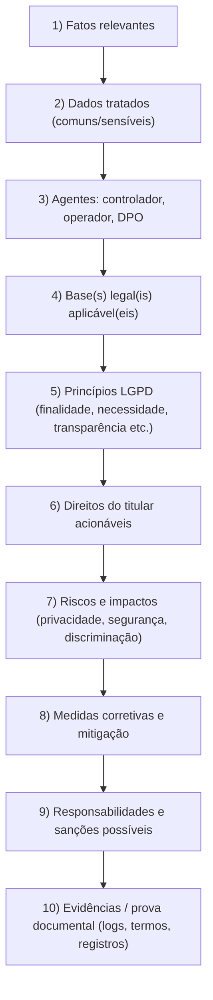
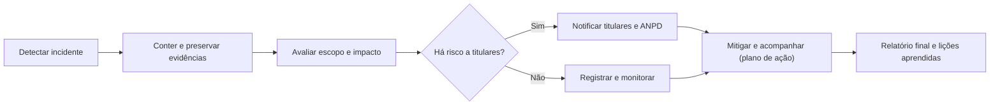

# 🧑‍⚖️ Capítulo 6 — Estudos de Caso e Jurisprudência (LGPD & Direito Digital)


> **Objetivo do capítulo:** analisar **situações reais e simuladas** envolvendo LGPD e Direito Digital, identificar **normas aplicáveis**, **direitos dos titulares**, **responsabilidades** e **boas práticas**, além de conhecer **entendimentos consolidados** (jurisprudência) úteis ao cotidiano escolar e profissional.

---

## 🧭 Sumário

* [1. Método de Análise de Casos (passo a passo)](#1-método-de-análise-de-casos-passo-a-passo)
* [2. Seis Estudos de Caso (com enquadramento completo)](#2-seis-estudos-de-caso-com-enquadramento-completo)
* [3. Jurisprudência e Entendimentos Consolidados](#3-jurisprudência-e-entendimentos-consolidados)
* [4. Checklists de Conformidade e Prova Documental](#4-checklists-de-conformidade-e-prova-documental)
* [5. Modelos e Templates (copiar/colar)](#5-modelos-e-templates-copiarcolar)
* [6. Exercícios de Fixação (modelo UC18)](#6-exercícios-de-fixação-modelo-uc18)
* [7. Atividades Práticas: Moot Court & Resposta a Incidentes](#7-atividades-práticas-moot-court--resposta-a-incidentes)
* [8. Fechamento](#8-fechamento)

---

## 1. Método de Análise de Casos (passo a passo)

Use este roteiro em **toda** situação analisada:



> 💡 **Dica pedagógica:** peça que os alunos **marquem** no enunciado onde aparece cada elemento (fatos, dados, agentes, base legal…). Isso treina leitura jurídica e pensamento sistêmico.

---

## 2. Seis Estudos de Caso (com enquadramento completo)

### 🏫 Caso 1 — “Mural de Notas”

**Fatos:** A escola publica, no site público, uma lista com **nome completo** dos alunos e **notas** por disciplina.
**Dados:** pessoais (nome), **potencialmente sensíveis** se revelarem condições particulares (ex.: justificativas médicas nas observações).
**Agentes:** Controlador = escola; Operador = empresa de hospedagem (se houver); DPO = contato indicado.
**Bases legais possíveis:** obrigação legal/regulatória (para **tratar** internamente), **não** para exposição pública; transparência pode ser feita **sem identificação**.
**Princípios:** finalidade, necessidade, minimização, **não discriminação**, segurança.
**Direitos do titular:** acesso, **oposição** ao tratamento excessivo, anonimização/bloqueio, petição à ANPD.
**Riscos:** exposição pública, dano moral, bullying.
**Medidas:** trocar a lista por **boletim individual** (acesso autenticado) ou **estatísticas anonimizadas**.
**Responsabilidades/sanções:** controlador pode sofrer advertência, publicização, multa e obrigação de corrigir.
**Evidências:** política de notas, registros de acesso, prints do site, notificação aos responsáveis.

---

### 🩺 Caso 2 — “Atestado no Grupo”

**Fatos:** Um servidor administrativo posta **atestado médico** de aluno **no grupo de WhatsApp da turma**.
**Dados:** **sensíveis** (saúde).
**Agentes:** Controlador = escola; Operador = mensageria (em regra não operador da escola); DPO = contato.
**Base legal:** tutela da saúde/proteção da vida (para uso **restrito**), **não** para divulgação pública.
**Princípios:** segurança, necessidade, prevenção, **não discriminação**.
**Direitos:** eliminação da postagem, informação sobre compartilhamento, reclamação à escola/ANPD.
**Riscos:** constrangimento, discriminação.
**Medidas:** **treinamento** de equipe, **canal oficial** para documentos de saúde, **política de grupos**.
**Sanções:** responsabilização da escola; medidas disciplinares internas ao agente que divulgou.
**Evidências:** regras internas, prints do grupo, trilha de quem enviou e quando.

---

### 📱 Caso 3 — “App Estuda+ e Geolocalização”

**Fatos:** App escolar coleta **geolocalização** contínua dos alunos sem explicar claramente.
**Dados:** pessoais (localização), perfis de uso.
**Agentes:** Controlador = empresa do app; Escola pode ser co-controladora dependendo do contrato.
**Base legal:** **consentimento informado** OU **interesse legítimo** com **teste de balanceamento** (necessidade + proporcionalidade + transparência).
**Princípios:** finalidade, transparência, minimização, segurança.
**Direitos:** acesso, informação, **revogação do consentimento**, **oposição** (se base = interesse legítimo).
**Riscos:** vigilância excessiva, perfis discriminatórios.
**Medidas:** tornar a localização **opt-in**, granularidade reduzida, botão **desativar**, retenção mínima, DPIA (avaliação de impacto).
**Sanções:** advertência/multa; ajustes contratuais com a escola.
**Evidências:** política de privacidade, tela de consentimento, logs de coleta.

---

### 🛒 Caso 4 — “Vazamento no E-commerce da Papelaria”

**Fatos:** Loja virtual que vende materiais escolares sofre **vazamento** de **e-mails e hashes de senha**.
**Dados:** pessoais; credenciais (risco moderado/alto conforme bcrypt/salting).
**Agentes:** Controlador = loja; Operador = provedor de nuvem.
**Base legal:** execução de contrato; proteção do crédito (em partes); obrigação de segurança.
**Princípios:** segurança, prevenção, responsabilização.
**Direitos:** informação ao titular, orientação de troca de senha, possibilidade de bloqueio.
**Riscos:** tomada de contas, phishing secundário.
**Medidas:** **comunicar titulares e ANPD**, reset forçado de senhas, MFA, revisão de segurança, relatório pós-incidente.
**Sanções:** multa, publicização, bloqueio de banco de dados (casos graves).
**Evidências:** trilha de auditoria, relatório de forense, data/hora do incidente, medidas adotadas.

---

### 🤖 Caso 5 — “Bolsa Negada por Algoritmo”

**Fatos:** Plataforma recusa **bolsa de estudos** com base em perfil **automatizado** sem explicação.
**Dados:** pessoais; possivelmente sensíveis se houver dados de saúde/origem.
**Agentes:** Controlador = plataforma; DPO = contato.
**Base legal:** execução de contrato/interesse legítimo; **atenção** à **revisão de decisão automatizada**.
**Princípios:** transparência, **não discriminação**, qualidade dos dados.
**Direitos:** **revisão por humano**, acesso às informações **essenciais** da lógica, correção de dados.
**Riscos:** viés algorítmico, exclusão indevida.
**Medidas:** canal de contestação, auditoria do modelo, explicabilidade, dataset curado.
**Sanções:** ordens de adequação e, em casos graves, sanções administrativas.
**Evidências:** documentação do modelo, critérios gerais, logs de decisão.

---

### 🎨 Caso 6 — “Vídeo com Trilha Famosa”

**Fatos:** Influenciador escolar publica vídeo com **música comercial** sem licença.
**Normas:** **Direitos Autorais** (Lei 9.610/98); termos da plataforma; **Marco Civil** (procedimentos de remoção).
**Riscos:** derrubada, desmonetização, reclamação do titular do fonograma/obra.
**Medidas:** usar **músicas licenciadas** (CC, bibliotecas livres) ou obter autorização.
**Evidências:** ID de conteúdo, notificações, licença utilizada.

---

## 3. Jurisprudência e Entendimentos Consolidados

> ⚠️ **Observação didática:** abaixo estão **entendimentos amplamente discutidos** em tribunais e órgãos brasileiros, úteis para **estudo** no Ensino Médio Técnico. Use-os como **bússola** para análise crítica.

* **“Direito ao esquecimento”**: o entendimento consolidado é que **não existe como regra geral** no Brasil; conflitos devem ser resolvidos pelos **direitos da personalidade**, **liberdade de expressão** e **responsabilidade civil**, caso a caso.
* **Remoção de conteúdo e plataformas**: é comum a exigência de **indicação específica** (ex.: URL) para retirada de conteúdo por ordem judicial, evitando ordens **genéricas** que gerem censura ampla.
* **Exposição indevida de imagem**: uso de **imagem sem consentimento** que cause dano pode gerar **indenização** (responsabilidade civil).
* **Registros e logs**: **provedores de aplicação e conexão** devem **guardar registros** por prazos legais e apresentá-los quando há **ordem judicial**, possibilitando identificação em crimes digitais.
* **ANPD e incidentes**: boas práticas indicam **comunicação célere**, **transparência** com titulares e **medidas técnicas** de mitigação; **documentação** do ocorrido é essencial.

> 💡 **Como usar em aula:** proponha aos alunos comparar um **caso hipotético** com esses entendimentos e justificar a **solução**.

---

## 4. Checklists de Conformidade e Prova Documental

### 4.1 Checklist rápido (LGPD em casos)

* [ ] **Finalidade** clara e legítima
* [ ] **Base legal** identificada
* [ ] **Dados mínimos** (minimização)
* [ ] **Transparência** ao titular
* [ ] **Segurança** (controles técnicos e administrativos)
* [ ] **Registros/ROPA** atualizados
* [ ] **Canal de DSR** (pedidos de titulares)
* [ ] **Plano de incidente** (notificação ANPD + titulares)
* [ ] **Contratos com operadores** (cláusulas de segurança, aviso de incidente)

### 4.2 Prova documental que costuma pesar

* Políticas (privacidade, segurança, retenção)
* Registros de consentimento / bases legais
* Logs de acesso e de decisão (inclusive algoritmos)
* Contratos e **aditivos LGPD** com operadores
* Evidências de treinamento de equipe
* Registro do **DPO** e canal de contato

---

## 5. Modelos e Templates (copiar/colar)

### 5.1 Comunicado de Incidente ao Titular

```text
Assunto: Comunicação de Incidente de Segurança – [Organização]

Prezada(o) [Nome],
Identificamos em [data/hora] um incidente que pode ter afetado seus dados: [descrição geral].
Categorias de dados envolvidas: [e-mail, nome, ...].
Medidas adotadas: [bloqueio, reset de senhas, forense].
Riscos potenciais: [phishing, acesso indevido].
Orientações: [troca de senha, MFA, atenção a e-mails suspeitos].
Canal de contato do DPO: [e-mail/telefone].
Atenciosamente,
[Nome do DPO] – Encarregado(a) de Dados
```

### 5.2 Registro Simplificado de Análise de Caso (para entrega do aluno)

```text
1) Fatos essenciais:
2) Dados tratados (comuns/sensíveis):
3) Agentes (controlador/operador/DPO):
4) Base(s) legal(is):
5) Princípios LGPD envolvidos:
6) Direitos do titular aplicáveis:
7) Riscos/impactos:
8) Medidas corretivas/mitigação:
9) Possíveis sanções:
10) Evidências/provas:
```

### 5.3 Fluxo de Resposta a Incidente (Mermaid compatível)



---

## 6. Exercícios de Fixação 

### 6.1 Dissertativas

1. A escola quer publicar **ranking nominal** de notas no site. Com base na LGPD, **discuta a legalidade**, os **princípios** envolvidos e proponha **duas alternativas** conformes.
2. Um app educacional usa **geolocalização** contínua para “melhorar a experiência”. Explique **base legal**, **direitos do titular** e **medidas de transparência**.
3. Explique por que a **revisão de decisões automatizadas** é importante para garantir **não discriminação** e **qualidade dos dados**.

### 6.2 Múltipla escolha

1. Em caso de incidente com risco aos titulares, o controlador deve:

   * [ ] Aguardar um mês para informar os usuários
   * [ ] **Comunicar titulares e ANPD de forma célere**
   * [ ] Apenas trocar senhas internamente
   * [ ] Nada, se os dados forem públicos
2. Publicar boletins com **nome e nota** de todos os alunos no site público:

   * [ ] É sempre permitido
   * [ ] **Fere princípios de necessidade e minimização**
   * [ ] Não é dado pessoal
   * [ ] Não envolve LGPD
3. Em decisões automatizadas, o titular tem direito a:

   * [ ] **Informações essenciais sobre a lógica** e **revisão humana**
   * [ ] Código-fonte completo do algoritmo
   * [ ] Indenização automática
   * [ ] Nada, pois a decisão é da empresa

### 6.3 Associação

| Nº | Elemento    | Definição                                     |
| -- | ----------- | --------------------------------------------- |
| 1  | Controlador | ( ) Define finalidades e meios do tratamento  |
| 2  | Operador    | ( ) Trata dados por conta do controlador      |
| 3  | DPIA        | ( ) Avaliação de impacto à proteção de dados  |
| 4  | ROPA        | ( ) Registro das operações de tratamento      |
| 5  | DSR         | ( ) Pedido de titular (acesso, correção etc.) |

### 6.4 Verdadeiro ou Falso

1. A **anonimização** irreversível tende a ficar fora do escopo da LGPD.
2. **Consentimento** é a **única** base legal aplicável.
3. **Interesse legítimo** exige **balanceamento** e **transparência**.
4. **Operadores** nunca respondem solidariamente.

**Opções:**

* [ ] V – F – V – F
* [ ] V – F – F – V
* [ ] F – V – V – F
* [ ] F – F – V – V

### 6.5 Estudo de Caso Integrador

Uma empresa terceirizada perde um **pendrive** com dados de alunos (nomes, e-mails e relatórios de desempenho). Elabore um **plano de resposta**: comunicações, medidas técnicas, responsabilidades, sanções possíveis e **evidências** a serem coletadas.

---

## 7. Atividades Práticas: Moot Court & Resposta a Incidentes

### 7.1 🎭 Moot Court (simulação de audiência)

* **Grupos:** Acusação (titulares), Defesa (controlador), Amicus Curiae (especialistas).
* **Tema:** “Publicação online de notas nominais”.
* **Entregáveis:** peças curtas (1 página) com **fatos**, **fundamentos** e **pedido**.
* **Rubrica (0–10):** fundamentação (0–4) | coerência fática (0–2) | clareza (0–2) | ética e respeito (0–2).

### 7.2 🚨 Mesa de Crise (resposta a incidente)

* **Cenários sorteados** (vazamento, geolocalização, decisão automatizada).
* **Tarefas:** aplicar o **fluxo Mermaid**; redigir **comunicado de incidente** (template 5.1); montar **checklist**.
* **Rubrica (0–10):** tempo de resposta (0–2) | adequação legal (0–4) | medidas técnicas (0–2) | comunicação clara (0–2).

---

## 8. Fechamento

> **Aprender com casos concretos** acelera a compreensão: vemos **princípios** ganhando vida, **direitos** sendo exercidos e **responsabilidades** efetivas.
> Na prática, **documentação**, **transparência** e **medidas de segurança** fazem a diferença entre um **incidente controlado** e um **dano ampliado**.
