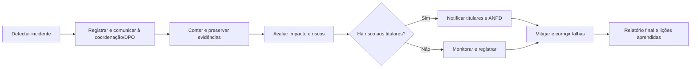

# 📘 Capítulo 7 — Projeto Final do Trimestre

**Cartilha LGPD + Plano de Resposta a Incidentes na Escola**

> **Objetivo do capítulo:** consolidar os conhecimentos sobre LGPD e Direito Digital através de um **projeto prático interdisciplinar**, que resulte em dois produtos:
>
> 1. **Cartilha Educativa LGPD** (linguagem acessível, para alunos e comunidade escolar).
> 2. **Plano de Resposta a Incidentes da Escola** (fluxo de notificação, responsabilidades, medidas técnicas).

---

## 🧭 Estrutura do Capítulo

- [1. Introdução ao Projeto Final](#1-introdução-ao-projeto-final)
- [2. Produtos a Desenvolver](#2-produtos-a-desenvolver)
- [3. Cronograma de Execução](#3-cronograma-de-execução)
- [4. Diretrizes da Cartilha LGPD](#4-diretrizes-da-cartilha-lgpd)
- [5. Diretrizes do Plano de Resposta a Incidentes](#5-diretrizes-do-plano-de-resposta-a-incidentes)
- [6. Ferramentas e Formatos](#6-ferramentas-e-formatos)
- [7. Critérios de Avaliação e Rubrica](#7-critérios-de-avaliação-e-rubrica)
- [8. Exemplos de Aplicação](#8-exemplos-de-aplicação)
- [9. Entregáveis e Apresentação Final](#9-entregáveis-e-apresentação-final)
- [10. Fechamento](#10-fechamento)

---

## 1. Introdução ao Projeto Final

📌 O projeto final do 3º trimestre é **integrador**: une teoria, prática e produção de material.

- **Tema central:** “Como proteger dados pessoais na escola e agir diante de incidentes digitais”.
- **Público-alvo:** alunos do Ensino Médio, professores, pais e comunidade escolar.
- **Competências mobilizadas:** análise crítica, produção de materiais de conscientização, planejamento de medidas de segurança e cidadania digital.

---

## 2. Produtos a Desenvolver

### 📕 Produto 1 — **Cartilha LGPD**

- Linguagem **clara, acessível, com ícones e exemplos práticos**.
- Voltada para alunos, pais e comunidade escolar.
- Deve responder a perguntas básicas:

  - O que é LGPD?
  - Quais dados a escola coleta?
  - Quais são os direitos dos alunos e responsáveis?
  - Como proteger dados no dia a dia?
  - O que fazer em caso de incidentes?

---

### 📑 Produto 2 — **Plano de Resposta a Incidentes**

- Documento interno (simulado pela turma).
- Estrutura mínima:

  1. **Detecção e registro do incidente**
  2. **Contenção imediata e preservação de evidências**
  3. **Avaliação de impacto e riscos**
  4. **Notificação à coordenação, titulares e ANPD**
  5. **Ações de mitigação e correção**
  6. **Relatório final e lições aprendidas**

---

## 3. Cronograma de Execução

| Semana | Atividade                                                                                      | Produto Parcial      |
| ------ | ---------------------------------------------------------------------------------------------- | -------------------- |
| 1      | Formação de grupos (3 a 5 alunos) + escolha de papéis (pesquisa, redação, design, coordenação) | Planejamento inicial |
| 2      | Pesquisa de **fontes confiáveis** (LGPD, cartilhas do CERT.br, sites da ANPD)                  | Mapa conceitual      |
| 3      | Rascunho da **cartilha** (textos + exemplos + ilustrações simples)                             | Versão preliminar    |
| 4      | Rascunho do **plano de incidentes** (fluxo + responsabilidades)                                | Checklist inicial    |
| 5      | Revisão em pares + ajustes de clareza                                                          | Versão beta          |
| 6      | Entrega e **apresentação final** (cartilha + plano)                                            | Produto final        |

---

## 4. Diretrizes da Cartilha LGPD

📖 Deve ser estruturada em **sessões curtas, ilustradas**:

- **Página inicial:** título, autores, turma, objetivo.
- **Capítulo 1:** O que é a LGPD (resumo simples).
- **Capítulo 2:** Exemplos práticos na escola (lista de chamada, boletins, fotos, redes sociais).
- **Capítulo 3:** Direitos dos titulares (explicados com ícones e frases curtas).
- **Capítulo 4:** Boas práticas de proteção de dados (senha forte, cuidado em grupos, autorização de imagens).
- **Capítulo 5:** O que fazer em caso de incidente (passo a passo simplificado).

💡 **Dica:** usar linguagem com **perguntas e respostas** (“Você sabia que…?” / “O que eu posso fazer?”).

---

## 5. Diretrizes do Plano de Resposta a Incidentes

🔐 O plano deve simular **como a escola reagiria** a um incidente (ex.: vazamento de notas, furto de notebook, divulgação de foto sem autorização).

Fluxo básico sugerido:

---

## 6. Ferramentas e Formatos

- **Cartilha:**

  - Google Docs / Canva / LibreOffice Impress → exportar em **PDF**.
  - Pode incluir QR Codes para vídeos ou sites.

- **Plano:**

  - Documento em Google Docs ou LibreOffice Writer.
  - Fluxo em **Mermaid**, Draw.io, Lucidchart ou Canva.
  - Checklist em tabela.

---

## 7. Critérios de Avaliação e Rubrica

| Critério                 | Peso | Descrição                                        |
| ------------------------ | ---- | ------------------------------------------------ |
| Clareza e acessibilidade | 2,0  | Linguagem simples, exemplos práticos             |
| Conteúdo jurídico        | 2,5  | Correta aplicação da LGPD e Direito Digital      |
| Organização e design     | 1,5  | Estrutura visual, títulos, ícones                |
| Criatividade             | 1,0  | Uso de exemplos originais, engajamento           |
| Plano de incidentes      | 2,0  | Fluxo claro, medidas adequadas, papéis definidos |
| Apresentação oral        | 1,0  | Clareza, divisão de falas, tempo adequado        |

**Total: 10,0 pontos**

---

## 8. Exemplos de Aplicação

- **Escola:** criar cartilha para **pais e alunos** sobre uso de WhatsApp e redes sociais.
- **Turma:** plano de resposta a incidentes para casos de **plágio digital** e **cyberbullying**.
- **Comunidade:** distribuir versão resumida da cartilha em **feira cultural** ou mural.

---

## 9. Entregáveis e Apresentação Final

📦 **Entrega em dupla forma:**

1. Arquivo digital (PDF) entregue no Classroom.
2. Apresentação oral (5 a 7 minutos por grupo).

🎤 **Formato da apresentação:**

- Breve introdução (1 min).
- Cartilha (3 min) — pontos principais explicados.
- Plano (2–3 min) — fluxo de resposta a incidentes.

---

## 10. Fechamento

> O **Projeto Final do Trimestre** consolida a aprendizagem:
>
> - A **Cartilha LGPD** torna o aluno **multiplicador de conhecimento** em sua comunidade.
> - O **Plano de Resposta a Incidentes** mostra que a escola pode se organizar de forma prática diante de riscos digitais.
>   Assim, unimos **teoria, prática e impacto social**, transformando o estudante em **protagonista da cidadania digital**.
